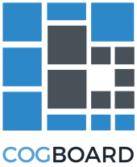

## Prerequisites - Installed Docker CE

* Install Docker CE on **Windows 10** - follow instructions [here](https://docs.docker.com/docker-for-windows/install/) and execute required config steps:
  * Log-in to `Docker Desktop` in Windows tray
  * Check `Expose daemon on...` property  
    

* Install Docker CE on **Mac OS** - follow instructions [here](https://docs.docker.com/docker-for-mac/install/)
* Install Docker CE on **Ubuntu Linux** - `sudo apt-get install docker-ce`, more instructions [here](https://www.digitalocean.com/community/tutorials/how-to-install-and-use-docker-on-ubuntu-16-04)

## Endpoints setup
In order to use widgets that communicate with third party software you must first configure endpoints.  
Edit this file `knotx/conf/endpoints.conf`.  
Any sensitive data from `endpoints.conf` file is never accessible for end-users. Only `id` and `title` can be requested.

## How to run
```
./gradlew
```
this will: `remove old docker container`, `build app`, `run tests`, `build docker image`, `run docker image`  

##### When launched go to http://localhost:8092/index.html to see your board

## How to build
```
./gradlew build
```
this will: `remove old docker container`, `build app`, `run tests`, `build docker image`

## How to debug

#### Normal debugging
Uncomment line in `Dockerfile`
```dockerfile
RUN sed -i 's/# JVM_DEBUG=/JVM_DEBUG=/g' /usr/local/knotx/bin/knotx
```

#### Startup debugging - use this when debugging `start()` methods
Uncomment line in `Dockerfile`
```dockerfile
RUN sed -i 's/suspend=n/suspend=y/g' /usr/local/knotx/bin/knotx
```

Comment out health-check section from `Dockerfile`
```dockerfile
#HEALTHCHECK --interval=5s --timeout=2s --retries=12 \
#  CMD curl --silent --fail localhost:8092/healthcheck || exit 1
```

**IMPORTANT !** - Make sure that `CMD [ "knotx", "run-knotx" ]` is a last command in `Dockerfile`

## Create new widget

1. Create new backend widget as a copy of `com.cognifide.cogboard.widget.type.ExampleWidget`
2. Update `com.cognifide.cogboard.widget.WidgetIndex.Companion.create` method with new widget
3. Create new frontend widget as a copy of `cogboard-webapp/src/components/widgets/types/ExampleWidget.js`
4. Update `cogboard-webapp/src/components/widgets/index.js` with new widget

#### TODO
- [ ] Cleanup example modules `./modules`
- [ ] Implement config storage
- [ ] Implement board routing
- [ ] Implement board switcher
- [ ] Implement preview mode (should be default)
- [ ] Implement widget: World Clock (show time in different timezones)
- [ ] Implement widget: Text (title or env. name)
- [ ] Implement widget: Icon 
- [ ] Implement widget: Healthcheck (configurable health-check list from specific AEM instance)
- [ ] Implement widget: Jenkins Job Status 
- [ ] Implement widget: Bamboo Job Status
- [ ] Implement widget: SonarQube Status
- [ ] Implement widget: Instance Bundle Info (bundle info from specific AEM instance)
- [ ] Implement widget: Link List 
- [ ] Implement widget: Todo List
- [ ] Implement widget: Timeline (tool for TPM and dev team about project milestones)
- [ ] Implement widget: Person Draw
- [ ] Implement widget: Timeline
- [ ] Implement widget: Checkbox
- [ ] Implement widget: Easy embed (for embedding iframes)

## Stack
 * Platform: [Knot.x](http://knotx.io/)
 * Backend language: [Kotlin](https://kotlinlang.org/)
 * Layout: [CSS Grid](https://developer.mozilla.org/en-US/docs/Web/CSS/CSS_Grid_Layout)
 * Webapp: [React JS](https://reactjs.org/)
 * Webapp model: [Redux](https://redux.js.org/)
 * Build with: [Gradle](https://gradle.org/)
